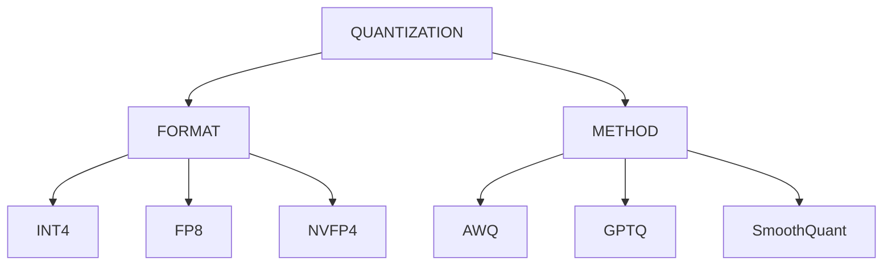

A long story again. Maybe not as long as the DGX Spark one. But this is the chapter where the theory finally met the terminal.

The first post was about **why I bought the machine**. The second was about **where my 128GB of unified memory was actually disappearing**.

I thought I finally had a decent mental model of LLMs.

Then I opened Hugging Face again.

And got completely overwhelmed.

**120B parameters. 1.2 trillion parameters. MoE. Dense. Reasoning. FP32. BF16. FP8. FP4. INT4. GPTQ. AWQ. RTN. GGUF. ONNX. vLLM. MLX. TensorRT-LLM. llama.cpp. CUDA. ROCm. Apple Silicon.**

Some of these I knew. Most I didn't.

But underneath all that noise, I could feel there was structure.

None of these things were actually competing with each other. They were sitting at different layers of the same stack — and nobody hands you that stack diagram when you start.

So I drew my own.

## The stack nobody drew for me

Here's the picture I ended up with:

```
Layer 1: Hardware

DGX Spark
RTX 5090
Mac Studio
Strix Halo


Layer 2: Runtime / Inference Framework

TensorRT-LLM
vLLM
PyTorch
MLX
llama.cpp


Layer 3: Model Representation / Format

Safetensors
GGUF
ONNX


Layer 4: Quantization Method

GPTQ
AWQ
SmoothQuant
RTN


Layer 5: Number Precision

FP16
BF16
FP8
FP4
INT8
INT4


Layer 6: Model Architecture

Dense
MoE
```


*The LLM inference iceberg — what we see on the surface is only a small part of the stack underneath.*

I know this isn't a perfect academic classification. Some of these layers overlap, and some tools span multiple layers.

But for my own mental model, this separation helped enormously.

What I was seeing on Hugging Face suddenly started making more sense.

A model isn't just a model.

There is the architecture.

There is how its numbers are represented.

There is how it was quantized.

There is how the model is stored.

There is the runtime that loads and executes it.

And finally, there is the hardware underneath it all.

And the first thing that kept bothering me was **size**.

# Why is the model so big?

Somewhere in this rabbit hole I had to stop and remind myself of something basic.

A model isn't a database of facts.

It's a neural network containing an enormous number of learned numerical parameters spread across its layers.

Those parameters are mostly **weights**, along with other learned values depending on the architecture.

And those numbers have to be stored somewhere.

That immediately gives you one obvious relationship:

**More parameters → more data to store.**

But there was another part I hadn't fully appreciated.

Even with exactly the same number of parameters, **how you represent those numbers changes the size dramatically.**

That is where precision comes in.

For example, if every parameter uses 32 bits, that's 4 bytes per parameter.

At 16 bits, it's 2 bytes.

At 8 bits, roughly 1 byte.

At 4 bits, roughly half a byte.

So take the same 70B parameter model and change only the representation:

| Format      | Precision | Bytes / Parameter | Approx. Weight Storage |
| ----------- | --------- | ----------------- | ---------------------- |
| FP32        | 32-bit    | 4 bytes           | ~280 GB                |
| FP16 / BF16 | 16-bit    | 2 bytes           | ~140 GB                |
| FP8 / INT8  | 8-bit     | 1 byte            | ~70 GB                 |
| FP4 / INT4  | 4-bit     | 0.5 bytes         | ~35 GB                 |

This is only a **conceptual weight-storage calculation**.

Real model files and runtime memory will be larger because you also have metadata, scaling information, runtime buffers, activations, KV cache and other overhead.

But the basic idea was now clear to me.

**Same model. Same number of parameters. Completely different memory footprint.**

And that made quantization suddenly much more interesting.

# So what exactly happens when we reduce precision?

This was another rabbit hole.

FP32.

FP16.

BF16.

FP8.

FP4.

INT8.

INT4.

At first I thought it was basically:

> Smaller number = smaller model.

True.

But incomplete.

The number of bits doesn't just determine how much space the number takes.

It also determines **how precisely we can represent numerical values and over what range**.

So when we move from something like FP16 to 4-bit representation, we're not simply shrinking the same numbers.

We're approximating them using fewer bits.

And that introduces **quantization error**.

Push precision down far enough and that error can start affecting model behaviour.

Depending on the model and task, you might see changes in accuracy, instruction-following, reasoning or output quality.

The interesting question isn't:

> **Is lower precision bad?**

It's:

> **Where does the error show up, and how much of it can we control?**

And that's where quantization methods start becoming interesting.

# Quantization is not one single thing

Once I sat with this long enough, quantization stopped looking like one giant blob of terminology.

It split into different concepts.

One useful distinction was:

## Quantization Flow Diagram



The format describes **how the numbers are represented**.

The method describes **how the quantization is performed and how the approximation is managed**.

For example, AWQ, GPTQ and SmoothQuant are different approaches to quantization. They don't simply mean "this is a different number of bits."

That distinction was important because I had initially been throwing all these names into the same bucket.

They aren't the same thing.

And then I found another axis I hadn't really thought about.

**When does the quantization happen?**

# PTQ vs QAT

There are two broad approaches I kept seeing.

### PTQ — Post-Training Quantization

```
Train Model
     ↓
Finished Model
     ↓
Quantize
     ↓
Deploy
```

The model is already trained.

You take the finished model and quantize it afterwards.

### QAT — Quantization-Aware Training

```
Training
    ↓
Simulate Quantization
    ↓
Adapt Model
    ↓
Final Quantized Model
```

Here, the training process takes the effects of quantization into account, allowing the model to adapt to the lower-precision representation.

QAT sounds attractive.

But it also means training again.

And I have **zero interest in retraining a giant model just to learn what quantization does to it.** 

I wanted something much simpler.

Take a finished model.

Push it.

Measure it.

See what changes.

So for my experiments, **PTQ was the obvious place to start.**

# Time to stop reading and start measuring

I'd read enough theory.

Now I wanted numbers from **my own machine**.

I wasn't trying to find the "best" quantization.

I was trying to isolate **one variable** and see what actually changed.

The plan was simple:

**Same model.**

**Same prompt.**

**Same context.**

**Same inference engine.**

**Same hardware.**

Change only the precision.

And measure:

- Model size
- Memory usage
- KV cache
- Tokens/sec
- Time to first token
- And, importantly, actual output quality

For the first experiment, I kept things simple.

**Ollama.**

**Llama 3.1 8B.**

Running directly on the DGX Spark.

I used three versions:

```
NAME                           SIZE
llama3.1:8b-instruct-fp16     16 GB
llama3.1:8b-instruct-q8_0     8.5 GB
llama3.1:8b-instruct-q4_K_M   4.9 GB
```


The size difference alone was already interesting.

Almost:

**15 GB → 8 GB → 5 GB**

Same model family.

Very different memory footprint.

Then I gave all three exactly the same prompt:

> **"Explain the difference between supervised and unsupervised learning in 3 sentences."**

I didn't want to trust a single run either.

Cold starts include model loading, so I ran each precision three times and used the warm runs for the performance comparison.

# The numbers

The results looked like this:

| Format | Size     | Cold Load | Prompt Eval  | Generation      | vs FP16   |
| ------ | -------- | --------- | ------------ | --------------- | --------- |
| Q4_K_M | 4.58 GB  | 5.04 s    | 1095.5 tok/s | **42.64 tok/s** | **2.69×** |
| Q8_0   | 7.95 GB  | 4.27 s    | 728.2 tok/s  | **29.11 tok/s** | **1.84×** |
| FP16   | 14.97 GB | 8.17 s    | 402.2 tok/s  | **15.83 tok/s** | **1.00×** |


Q4_K_M generated almost **2.7× faster** than FP16 in this experiment, while taking up roughly a third of the model storage.

Q8_0 sat nicely in between.

This was the first time the theory from the table above became something I could actually see on my own machine.

**The smaller representations were faster in this particular setup.**

And the reason made more sense now.

Lower-bit representations mean less weight data needs to move through the memory hierarchy during generation.

But I don't want to turn that into:

> "Q4 is always faster."

It isn't that simple.

Hardware matters.

Kernels matter.

The inference engine matters.

The exact quantization format matters.

But in my setup, the relationship was very clear.

**Smaller representation → less data movement → faster generation.**

At least for this experiment.

# Same facts, different manners

The speed numbers were satisfying.

But the output itself was the part that surprised me.

All three models got the facts right.

No hallucination.

No fabricated nonsense.

The difference was somewhere else.

**Instruction-following.**

FP16 followed the request for three sentences.

Q8_0 did the same.

Q4_K_M didn't.

It restructured the answer into two bolded sections, added examples I hadn't asked for, and produced an answer roughly twice as long as requested.

That was interesting.

But I want to be careful here.

I don't want to write:

> "Q4 makes the model dumber."

That's not what this experiment showed.

The more accurate observation is:

> **In this particular run, lower precision did not break the model's factual knowledge, but the Q4 model was less faithful to the formatting constraint I gave it.**

And even that is only one prompt.

One sample.

One model.

One setup.

Sampling and other inference factors can influence the output too.

So I wouldn't call this a conclusion yet.

I'd call it a **lead worth chasing**.

And that's actually more interesting to me.


Now I had two things I could measure.

**Performance.**

And **behaviour.**

And I wanted to understand how much of that behaviour came from the quantization itself.

# Just when FP8 felt like the answer

Somewhere in all this reading, I kept seeing FP8 described as a very attractive balance between size, speed and quality.

It made sense.

Go from 16-bit to 8-bit.

Cut the weight storage roughly in half.

Get the benefits of lower precision without going all the way down to 4-bit.

I thought I was beginning to see the pattern.

Then I found **NVFP4**.

And suddenly the equation became more interesting again.

NVFP4 isn't simply:

> "Take FP8 and make it smaller."

The interesting part is **how the scaling works**.

NVFP4 uses a 4-bit floating-point representation, with finer-grained scaling applied to small groups of values.

Conceptually:

```
16 values
    ↓
4-bit FP4 values
    +
local FP8 scale
    +
global FP32 scale
```

That means different groups of values can have their own local scale rather than forcing a whole tensor to share one scale.

And that matters because neural-network values don't all live in the same numerical range.

The limited number of bits becomes much more useful when the scaling is done intelligently.

That was another little mental shift for me.

I had been thinking:

> **4-bit = 4-bit.**

But apparently:

> **How those four bits are used matters too.**


And now I had another problem. 😂

I started with:

> "How big is this model?"

Then:

> "What precision is it using?"

Then:

> "What quantization method was used?"

Then:

> "How are those values actually represented?"

And finally:

> **"Which hardware and inference engine can actually take advantage of all this?"**

Because there is no point finding an interesting quantization format if my runtime can't execute it efficiently.

And that's where this rabbit hole took another turn.

# What's next?

Here's the thing that keeps happening to me with this machine.

**Every question pulls me one layer deeper than I expected.**

Quantization led me to model sizing.

Model sizing led me to memory.

Memory led me to KV cache.

And now precision has pulled me toward inference engines themselves.

Because I can't really answer:

> **"Why does NVFP4 work so differently on this hardware?"**

without understanding what the inference engine is actually doing underneath.

Which means I now want to go back one layer and properly understand the runtimes I've been casually throwing around:

**vLLM.**

**TensorRT-LLM.**

**llama.cpp.**

And what actually happens between:

```
Model   ↓Quantized Weights   ↓Inference Engine   ↓GPU Kernels   ↓Memory   ↓Tokens
```

I started this post wanting to understand quantization.

Instead, quantization dragged me sideways into needing to understand inference engines first.

**Long story long — that's probably exactly how this machine is going to keep teaching me.** 
